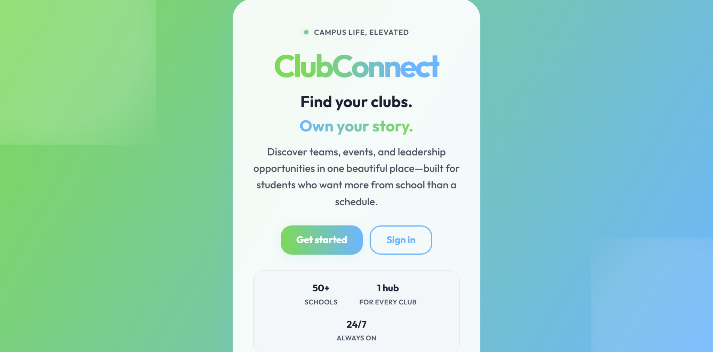

# ClubConnect

<p align="center">
  
</p>

## What it is
- ClubConnect is a web app that keeps everything about your school clubs in one spot
- You can find clubs, see events, RSVP, check in to stuff with a QR code, and keep track of what you are part of
- Basically instead of clubs living in five different group chats and a paper sign up sheet, it is all in one place

## Why I made it
- Honestly the whole reason was that organizing clubs is super messy and can get really hard
- Nobody knows what is going on, sign ups get lost, reminders get buried, and it is confusing for new people
- I wanted to build the thing I wished my school had so club stuff is actually easy to keep up with

## What you can do in it
- Browse and join clubs
- See upcoming events on a calendar
- RSVP to events and check in with a QR code
- Earn points and badges for showing up and taking part
- Keep a little portfolio of everything you have been involved in
- There is also a feed, messages, notifications, voting, and an analytics page

## How to try it
- You need Node.js installed on your computer
- Then open the project folder and run these:

```bash
npm install
npm run dev
```

- It will give you a link (something like `http://localhost:5173/`), open that in your browser and you are in

## Tools I used
- React and React Router for the pages and moving around the app
- Vite to run and build everything
- Chart.js for the graphs on the analytics page
- the qrcode library for making the event check in codes
- localStorage to save accounts and data, so you can try it without setting up a backend

## A few honest notes
- This is a student project so it is still a work in progress and some parts are rougher than others
- I built it over about a month, roughly 40 hours of work
- Feel free to click around, break stuff, and tell me what you think
